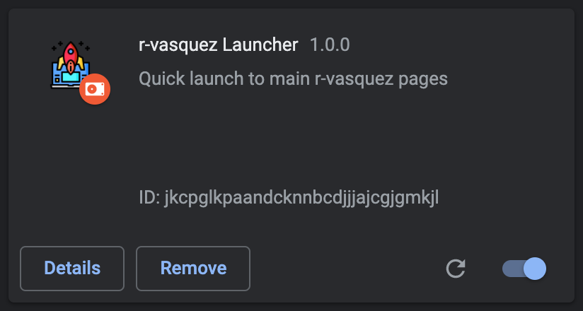
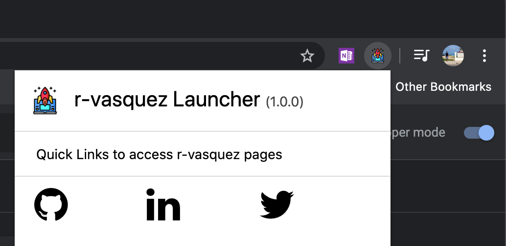

# r-vasquez Launcher

Quick excercise to know how to get around with chrome extensions. I added a simple html to have a modal that contains links to my linkedIn, Twitter & Github pages.

I didn't upload it to the chrome store, but this is an example of how it looks:

